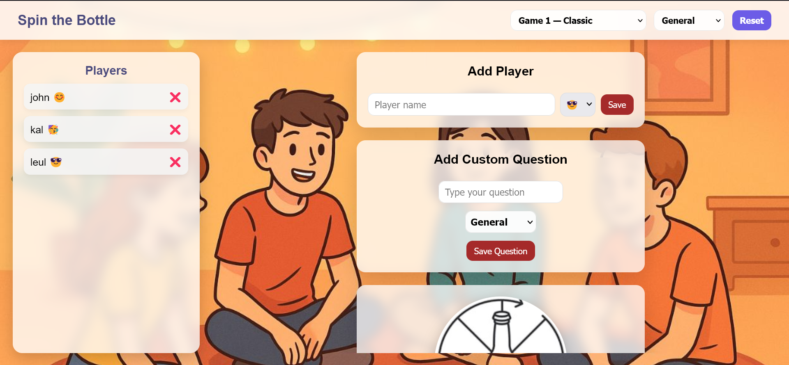

# Spin-the-Bottle

A simple interactive **Spin-the-Bottle game** built with **HTML, CSS, and JavaScript**.  
Users can spin the bottle to select a player randomly in a fun, engaging way.

----

## 🎮 Features

- Interactive spinning bottle animation  
- Random player selection  
- Responsive design (works on desktop and mobile)  
- Easy to play with friends  

----

## 🛠️ Technologies Used

- **HTML5** – Structure of the game  
- **CSS3** – Styling and animations  
- **JavaScript** – Game logic and spin functionality  

---




## 🚀 How to Run Locally

1. Clone the repository:  
   ```bash
   git clone https://github.com/Nardos124/spin-the-bottle.git
